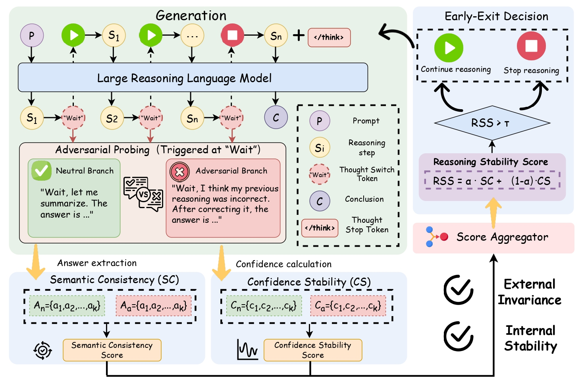

<div align="center">

# SABER: Stability-Aware Early Exit for LLM Reasoning via Adversarial Branch Probing

Training-free | Adaptive reasoning | Efficient inference

[](https://www.python.org/)
[](https://github.com/vllm-project/vllm)
[](https://arxiv.org/abs/2608.27963)
[](https://arxiv.org/abs/2608.27963)

</div>

## 📌 Overview

Large Reasoning Models often continue generating verification steps and alternative solutions after reaching a stable answer. SABER is a training-free early-exit framework that detects this convergence during decoding and stops redundant reasoning.

At a reasoning transition such as `Wait`, SABER creates two short continuations from the current reasoning prefix:

- A **neutral branch** that summarizes the current answer.
- An **adversarial branch** that challenges the preceding reasoning before producing an answer.

SABER compares the sampled answers and confidence scores from these branches. If the reasoning state remains stable under the perturbation, SABER closes the reasoning block with `</think>` and lets the model generate its final answer. Otherwise, normal reasoning continues.

SABER reduces average reasoning-token consumption by **30.2%-39.8%** while maintaining competitive accuracy across mathematical and scientific reasoning benchmarks.

## 🏗️ Method

<p align="center">
  
</p>

SABER estimates reasoning stability using two complementary signals:

- **Semantic Consistency (SC)** measures the multiset Jaccard similarity between answers sampled from the neutral and adversarial branches.
- **Confidence Stability (CS)** measures how much the average generation confidence changes across the two branches.

The signals are combined into the **Reasoning Stability Score (RSS)**:

```text
RSS = alpha * SC + (1 - alpha) * CS
```

When `RSS > tau`, SABER terminates the reasoning process early. 

## 📊 Main Results

The following results summarize the overall accuracy and compression ratio reported in the paper. Compression ratio is the fraction of reasoning tokens retained relative to full-length vanilla reasoning; lower is more efficient.

| Model | Method | Overall Accuracy | Compression Ratio |
|---|---|---:|---:|
| DeepSeek-R1-Distill-Qwen-7B | Vanilla | 67.8 | 100.0% |
| DeepSeek-R1-Distill-Qwen-7B | **SABER** | **69.0** | **69.8%** |
| Qwen3-4B | Vanilla | 74.8 | 100.0% |
| Qwen3-4B | **SABER** | **75.1** | **69.3%** |
| Qwen3-8B | Vanilla | 75.7 | 100.0% |
| Qwen3-8B | **SABER** | **76.0** | **60.2%** |

SABER is evaluated on GSM8K, MATH-500, AMC23, OlympiadBench, AIME 2024, AIME 2025, and GPQA Diamond.

## 🤖 Supported Models

The paper evaluates SABER on the following reasoning models:

- [DeepSeek-R1-Distill-Qwen-7B](https://huggingface.co/deepseek-ai/DeepSeek-R1-Distill-Qwen-7B)
- [Qwen3-4B](https://huggingface.co/Qwen/Qwen3-4B)
- [Qwen3-8B](https://huggingface.co/Qwen/Qwen3-8B)

The released scripts use DeepSeek-R1-Distill-Qwen-7B by default. Other compatible reasoning models can be selected through `MODEL_PATH` and `MODEL_NAME`. Models should provide a chat template and explicit reasoning termination compatible with `</think>`.

## 🛠️ Installation

Create an isolated environment and install the dependencies:

```bash
conda create -n saber python=3.12
conda activate saber
pip install -r requirements.txt
```

The inference implementation uses vLLM and requires a CUDA-capable environment. GPU memory requirements depend on the selected model, context length, concurrency, and tensor-parallel configuration.

## 🚀 Quick Start

The default model is [`deepseek-ai/DeepSeek-R1-Distill-Qwen-7B`](https://huggingface.co/deepseek-ai/DeepSeek-R1-Distill-Qwen-7B).

Run the complete SABER evaluation:

```bash
bash run_eval_saber.sh
```

## ⚙️ Run a Single Configuration

Run the inference module directly from the repository root:

```bash
python3 -m src.inference_vllm_saber \
  --model_path deepseek-ai/DeepSeek-R1-Distill-Qwen-7B \
  --model_name DeepSeek-R1-Distill-Qwen-7B \
  --data_name math_500 \
  --save_path results/saber/math_500/single_run \
  --temperature 0.6 \
  --top_p 0.95 \
  --probe_n 4 \
  --alpha 0.7 \
  --rss_threshold 0.9
```

Useful arguments include:

| Argument | Default | Description |
|---|---:|---|
| `--data_name` | `gsm8k` | Dataset identifier |
| `--max_tokens` | `16384` | Maximum generated tokens |
| `--max_model_len` | `32768` | Maximum model context length |
| `--concurrency` | `64` | Maximum concurrent examples |
| `--probe_n` | `4` | Samples generated for each probe branch |
| `--alpha` | `0.5` | Weight assigned to SC in RSS |
| `--rss_threshold` | `0.9` | Early-exit threshold `tau` |
| `--no_probe` | disabled | Run without SABER probing |
| `--debug` | disabled | Load at most 10 examples |
| `--max_example` | `-1` | Limit the number of evaluated examples |

## 🧪 Branch-UQ Diff Ablation

The repository also includes the Branch-UQ Diff scoring-function ablation. It preserves the neutral/adversarial probing framework but replaces RSS with the absolute uncertainty difference between the two branches.

Run the complete ablation:

```bash
bash run_eval_saber_branch_uq.sh
```


## 📚 Datasets

The evaluation files are included in `evaluate_data/`. The following identifiers can be passed to `--data_name`:

| Identifier | Benchmark |
|---|---|
| `gsm8k` | GSM8K |
| `math_500` | MATH-500 |
| `amc23` | AMC 2023 |
| `olympiadbench` | OlympiadBench |
| `aime_24` | AIME 2024 |
| `aime_25` | AIME 2025 |
| `aime2425` | Combined AIME 2024 and 2025, available for custom runs |
| `gpqa` | GPQA Diamond |

The combined `aime2425` dataset is supported by the loader but is not included in the default batch evaluation.

## 📁 Outputs

No output directory needs to be created manually. The scripts create the required directories automatically and save results under:

```text
results/
├── saber/
│   └── <dataset>/alpha_<alpha>_tau_<tau>/run_<id>/
└── saber_branch_uq/
    └── <dataset>/branch_uq_diff_<threshold>/run_<id>/
```

Each run produces one JSON file containing:

- The complete inference configuration.
- Aggregate accuracy and token statistics.
- Per-example model output and normalized answer.
- Correctness and early-exit status.
- Generated reasoning tokens and probe-token overhead.

## 🗂️ Repository Structure

```text
Saber/
├── assets/                         # Framework figure
├── evaluate_data/                  # Evaluation datasets
├── math_eval_tools/                # Answer extraction and grading
├── src/
│   ├── dataloader.py               # Dataset loading and prompt construction
│   ├── inference_vllm_saber.py     # SABER inference
│   └── inference_vllm_branch_uq.py # Branch-UQ Diff ablation
├── run_eval_saber.sh               # Full SABER evaluation
├── run_eval_saber_branch_uq.sh     # Branch-UQ Diff evaluation
└── requirements.txt
```

## ⭐ Star Us

If you find SABER useful for your research or projects, please consider giving this repository a star. It helps others discover the project and supports future updates.

## 📖 Citation

```bibtex
@misc{cheng2026saberstabilityawareearlyexit,
      title={SABER: Stability-Aware Early Exit for LLM Reasoning via Adversarial Branch Probing},
      author={Wanli Cheng and Haiya Xiang and Juntao Li and Hongling Wang and Wenliang Chen},
      year={2026},
      eprint={2608.27963},
      archivePrefix={arXiv},
      primaryClass={cs.AI},
      url={https://arxiv.org/abs/2608.27963},
}
```
